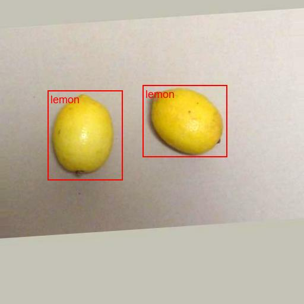
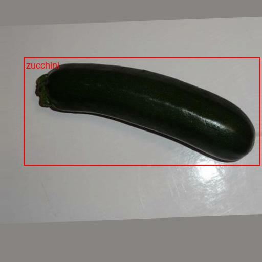
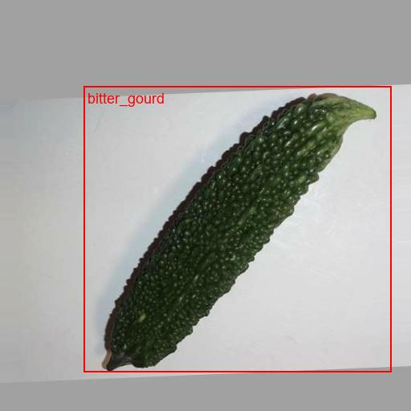
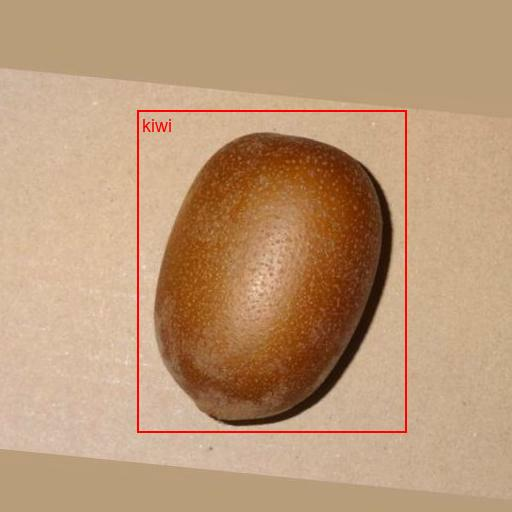
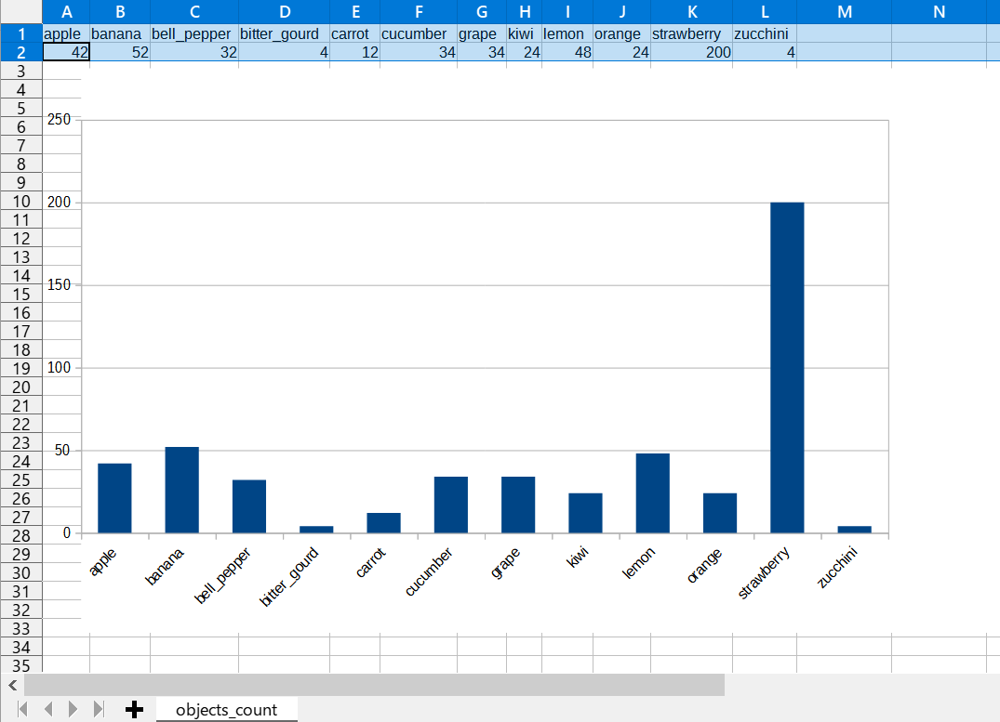

# TFRecordInspector

This is a simple python <a href="./TFRecordInspector.py">TFRecordInspector</a> class to inspect a tensorflow tfrecord. 
This will parse an input tfrecord file, extract the images, labels, and bboxes from it, 
and write the annotated images to the files. 

For example, please run the following command 

<pre>
> python TFRecordInspector.py ./tfrecord/sample.tfrecord ./tfrecord/label_map.pbtxt ./output
</pre>

Note: 
  To run this script, you have to install tensorflow 2 and related packages. 
 
By running this script, a lot of image files which are originally included in the tfrecord
will be extracted and saved to the <b>output_dir</b> with annotations. 
Also, an objects_count csv file generated in <b>ouput/objects_count</b> folder. 

The images in output_dir will be shown as. 
 

 
Sample images 
  
  
  
  
  
  
  
  
  
  
  

Objects_count.csv  

<a href="./output/objects_count/objects_count.csv">objects_count.csv</a>
 

 
You can see the imbalanced categories. 

