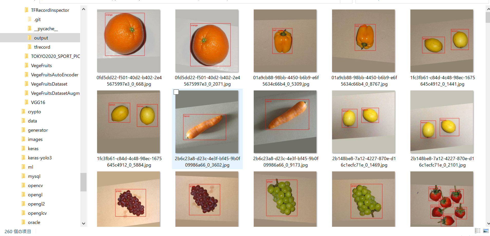
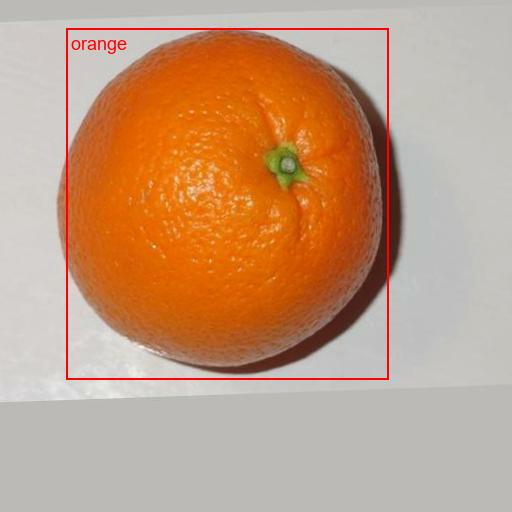
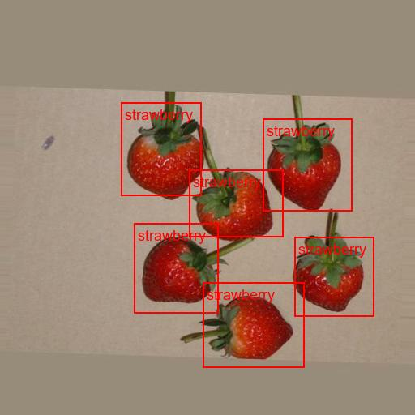
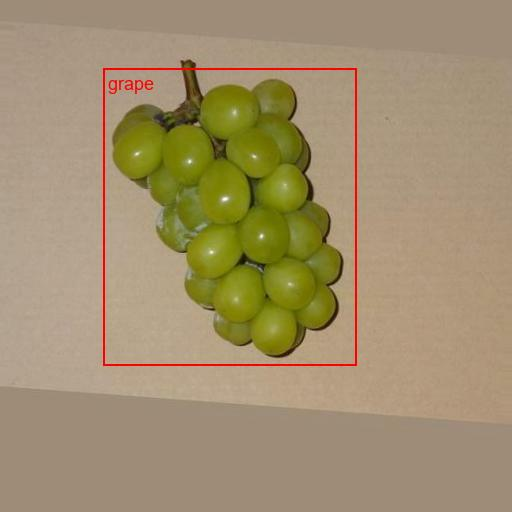
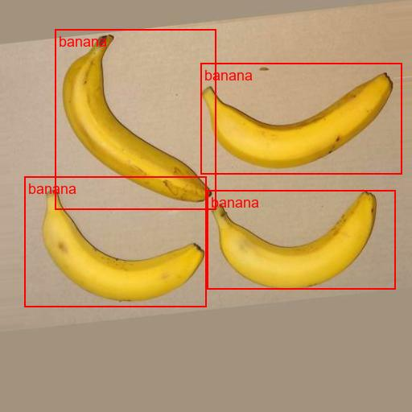
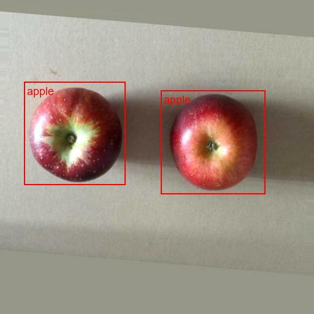
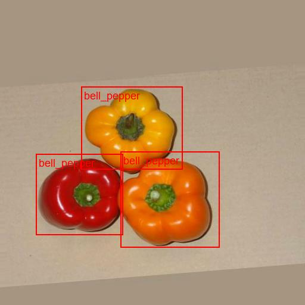
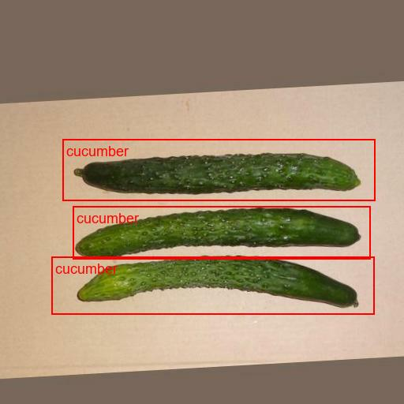

# TFRecordInspector

This is a simple python <a href="./TFRecordInspector.py">TFRecordInspector</a> class to inspect a tensorflow tfrecord. 
This will parse an input tfrecord file, extract the images, labels, and bboxes from it, 
and write the annotated images to the files. 

For example, @lease run the following command 

<pre>
> python TFRecordInspector.py ./tfrecord/sample.tfrecord ./tfrecord/label_map.pbtxt ./output_dir
</pre>

Note: 
  To run this script, you have to install tensorflow 2 and related packages. 
 
The images in output_dir will be shown as. 
 

 
Sample images 
  
  
  
  
  

  

  

